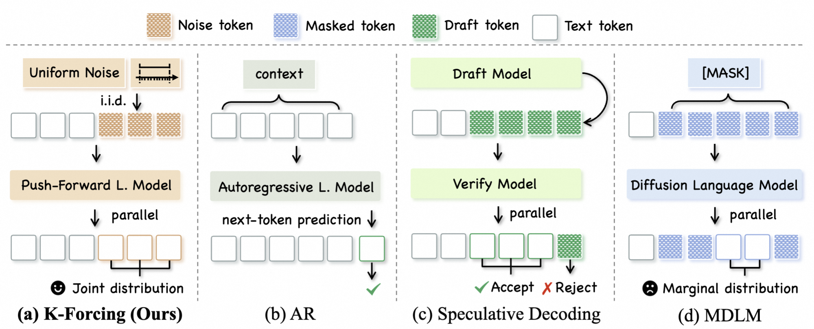

# K-Forcing: Joint Next-K-Token Decoding via Push-Forward Language Modeling

## Introduction

K-Forcing is a push-forward language modeling paradigm for **joint next-k-token decoding**. It distills an existing autoregressive (AR) model into a conditional push-forward mapping that transforms independent uniform noise variables into a joint sample of multiple future tokens in a single forward pass. This design preserves fixed-length outputs, reuses the AR backbone architecture, and enables significant inference speedup under high-load batch serving — the scenario most critical for industrial-scale deployment.

<p align="center">
  
</p>

**Comparison of four language-model inference paradigms within one forward evaluation.**
**(a) K-Forcing (ours)** uses a push-forward language model to map i.i.d. uniform noise tokens to a fixed-length block of future tokens, modeling their joint distribution.
**(b) AR** predicts one next token from the current context, leading to memory-bound decoding.
**(c) Speculative decoding** drafts a token block and verifies it with the target AR model, yielding a variable number of accepted tokens that breaks regular batching.
**(d) MDLM** predicts masked positions in parallel from per-position marginals, rather than their joint distribution.

## Venv Setup

```bash
# 1. Download flash-attn wheel
mkdir -p wheels
wget -P wheels https://github.com/Dao-AILab/flash-attention/releases/download/v2.5.6/flash_attn-2.5.6+cu122torch2.2cxx11abiFALSE-cp39-cp39-linux_x86_64.whl

# 2. Install
uv sync
```

## Checkpoints

| Model | Dataset | HuggingFace |
|-------|---------|-------------|
| AR    | OWT     | TBD         |
| AR    | LM1B    | TBD         |
| PFLM (k=4) | OWT | TBD     |
| PFLM (k=4) | LM1B | TBD   |
| MDLM  | OWT     | [kuleshov-group/mdlm-owt](https://huggingface.co/kuleshov-group/mdlm-owt) |

## Inference

`batch_inference_with_prefix.py` runs batched generation from text prefixes and reports throughput. All generation uses temperature 1.0 sampling:

- **AR**: stochasticity from multinomial sampling over the next-token softmax distribution at each step.
- **PFLM (K-Forcing)**: stochasticity from K i.i.d. Uniform(0,1) noise variables fed as input; the push-forward map deterministically transforms them into K tokens per forward pass.
- **MDLM**: stochasticity from multinomial sampling at each masked position independently (per-position marginals).

| Argument | Description |
|----------|-------------|
| `--model` | Model type: `ar`, `pflm`, or `mdlm` |
| `--task` | Dataset/tokenizer config: `owt` (GPT-2, seq_len=1024) or `lm1b` (BERT, seq_len=128) |
| `--ckpt_path` | Path to checkpoint (not needed for `mdlm`) |
| `--prefix_file` | JSONL file with `{"prefix": "..."}` entries |
| `--K` | Number of tokens decoded per forward pass for `pflm`/`mdlm` (default: 4) |
| `--batch_size` | Batch size (default: 16) |
| `--num_samples` | Number of completions per prefix (default: 1) |
| `--output_dir` | Output directory for samples and throughput stats |
| `--warmup_steps` | Warmup batches before timed run (default: 1) |

```bash
# AR inference on OWT
python batch_inference_with_prefix.py \
    --model ar --task owt \
    --ckpt_path /path/to/ar_owt.ckpt \
    --prefix_file assets/prefix_owt_examples.jsonl \
    --batch_size 4 --num_samples 1

# PFLM inference on OWT (K=4 tokens per forward pass)
python batch_inference_with_prefix.py \
    --model pflm --task owt \
    --ckpt_path /path/to/pflm_owt_k4.ckpt \
    --prefix_file assets/prefix_owt_examples.jsonl \
    --batch_size 4 --num_samples 1 --K 4

# AR inference on LM1B
python batch_inference_with_prefix.py \
    --model ar --task lm1b \
    --ckpt_path /path/to/ar_lm1b.ckpt \
    --prefix_file assets/prefix_lm1b_examples.jsonl \
    --batch_size 4 --num_samples 1
```

## TODO

- [ ] Arxiv paper release
- [ ] Checkpoint release on HuggingFace
- [ ] Training recipe (progressive self-forcing distillation)
